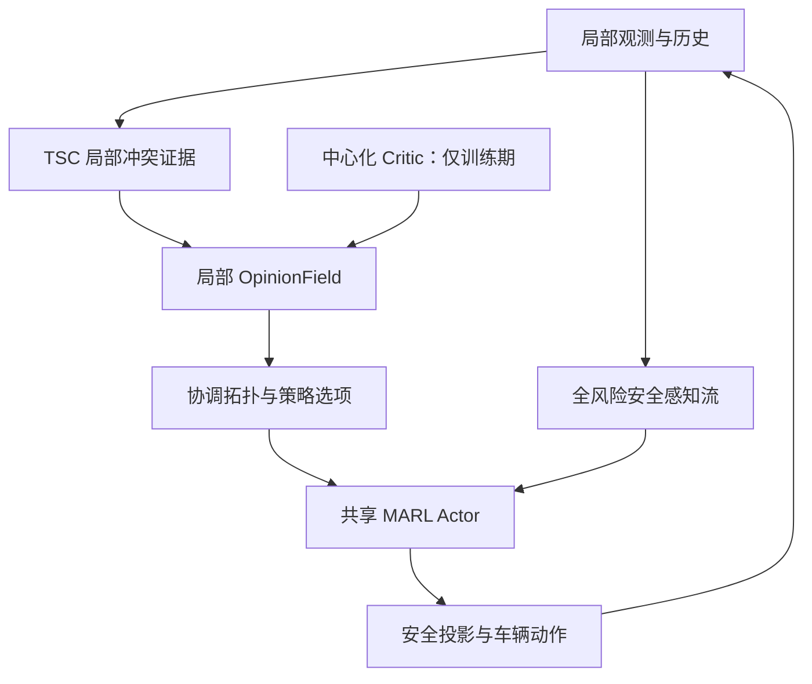

# 意见动力学 + MARL 技术设计说明

> 建议方案名：**Opinion-Dynamic TSC（OD-TSC）**  
> 中文名：**意见动力学增强的拓扑条件 Stackelberg 协调**  
> 文档用途：作为后续 Codex 阅读项目、制定修改计划和实施代码改造的统一技术依据。  
> 文档状态：v0.1，先做最小可验证改造，再逐步引入价值塑造与安全增强。

---

## 0. 一页式结论

本方案不重新发明一套 MARL，也不否定原 TSC。它以 TSC 为基座，解决 TSC 中局部优先拓扑缺少显式时间状态的问题。

原 TSC 的核心链路可抽象为：

\[
o_i^t
\rightarrow
\hat p_{i\leftarrow j}^t,\hat s_i^t
\rightarrow
L_i^t
\rightarrow
\pi_i(a_i^t).
\]

其中优先关系由当前观测前馈生成。它可以随时间变化，但没有独立的动态状态来描述“观望、承诺、保持、撤销”。本方案将 TSC 的瞬时拓扑输出重新解释为**当前时刻的外部证据**，再由局部非线性意见场积累证据并形成具有分岔、记忆和迟滞的通行约定：

\[
o_i^t
\rightarrow
e_{ij}^t
\rightarrow
\text{OpinionField}(q_i^{t-1},e_i^t)
\rightarrow
z_{ij}^t
\rightarrow
L_i^t
\rightarrow
\pi_i(a_i^t).
\]

一句话概括：

> TSC 负责从空间交互中识别“谁与谁需要协调”；意见动力学负责这些局部优先关系如何跨时间形成、保持和撤销；MARL 负责在给定协调结构后学习具体驾驶动作；独立安全流负责在意见错误或不一致时仍然感知所有危险对象。

第一阶段只实现**固定结构、可解释参数的局部 NOD**，并与原始 TSC、EMA、GRU 和线性动力学对比。只有当非线性意见动力学在优先级翻转、互相让行、争抢、遮挡恢复等指标上显著优于普通记忆基线时，才进入反事实价值塑造阶段。

---

## 1. 研究定位与核心假设

### 1.1 研究定位

最可信的研究增量不是“提出一个整体上优于 TSC 的全新 MARL”，而是：

> TSC 建立了无通信条件下基于空间拓扑的局部 Stackelberg 协调；OD-TSC 进一步研究这种局部优先拓扑如何跨时间形成承诺、抵抗扰动、适时撤销，并在后续阶段由长期价值选择稳定分支。

因此，以下内容不是本方案相对 TSC 的新增贡献，必须保留而不能重复包装：

- ego-centric 局部观测与无通信分散执行；
- 局部冲突图、边优先概率和节点优先势；
- Top-\(K\) 邻居选择与拓扑注意力；
- Actor 不读取邻车真实当前动作；
- 训练期邻车动作预测与 Stackelberg-conditioned Critic；
- CTDE、参数共享、拓扑监督与一致性损失。

本方案重点补足：

- 优先关系的显式时间状态；
- “观望—承诺”的非线性状态转变；
- 承诺保持、迟滞和有限记忆；
- 噪声、延迟、短暂遮挡和邻居集合变化下的拓扑稳定性；
- 后续可选的长期价值驱动分支选择；
- 将安全感知与协调拓扑解耦，避免 Top-\(K\) 或错误意见删除危险对象。

### 1.2 核心研究假设

需要通过实验检验以下假设，而不是预先当作结论：

1. **H1：** 显式意见状态能够减少逐帧优先关系翻转。
2. **H2：** 非线性双稳态与迟滞在对称冲突、互相让行和噪声环境中优于 EMA、GRU 与线性滤波。
3. **H3：** 基于冲突紧迫度的分岔参数能够在低风险时保持中性、在高风险时及时形成明确承诺。
4. **H4：** 价值塑造的 bias 能够比纯几何证据选择更高长期回报的通行顺序。
5. **H5：** 安全流与协调流解耦后，意见判断错误不会导致 Actor 忽略真实风险邻居。

只有 H2 成立，才能说明收益来自“分岔式约定形成”，而不只是增加了循环状态。

---

## 2. 必须遵守的问题设定

### 2.1 无通信分散执行

执行阶段，第 \(i\) 辆车只能使用：

\[
h_i^t=(o_i^{0:t},a_i^{0:t-1}),
\]

其中 \(o_i^t\) 必须来自本车可获得的信息，例如：

- 自车状态；
- 可见邻车的相对位置、速度、航向和历史轨迹；
- 道路几何、局部参考路径与交通规则；
- 从局部历史估计的邻车意图、冲突概率与预测不确定性。

执行阶段禁止使用：

- 其他车辆的内部 opinion 或策略隐状态；
- 其他车辆尚未执行的当前动作；
- 仿真器中的真实未来轨迹；
- 全局优先级、全局冲突图或中心化状态；
- 仅训练期可见的标签或 Critic 输出。

所有车辆同时行动：

\[
\pi(\mathbf a_t\mid\mathbf h_t)
=
\prod_i\pi_i(a_i^t\mid h_i^t).
\]

车辆之间唯一的在线“信号”是可观察的物理运动：

\[
a_j^{t-1}
\rightarrow
\text{车辆 }j\text{ 的运动}
\rightarrow
o_i^t
\rightarrow
\text{车辆 }i\text{ 的局部判断}.
\]

### 2.2 严格的局部视角

每辆车维护自己的局部意见场：

\[
q^i\neq q^j.
\]

车辆 \(i\) 对车辆 \(j\) 的估计不等于车辆 \(j\) 的真实内部状态：

\[
q_{j\mid i}\neq q_{j\mid j}.
\]

因此，方案不能声称执行时存在所有车辆共享的全局优先图，也不能无条件声称全局无环。

---

## 3. 总体架构



各层职责必须保持清晰：

| 层次 | 输入 | 输出 | 只解决什么问题 |
|---|---|---|---|
| 冲突感知层 | 局部观测与历史 | 冲突权重、几何证据、不确定性 | 谁与谁存在真实时空耦合 |
| 意见动力学层 | 上一时刻意见、当前证据、紧迫度 | 连续意见状态与局部方向关系 | 何时承诺、倾向哪个分支、何时撤销 |
| 协调策略层 | ego 表征、局部意见拓扑 | 驾驶动作分布 | 给定局部约定后如何驾驶 |
| 安全层 | 所有风险邻居与候选动作 | 可执行安全动作 | 哪些动作即使策略偏好也不能执行 |
| 中心化 Critic | 训练期联合状态与分支假设 | 长期价值及价值差 | 训练 Actor，并在后期塑造意见 bias |

---

## 4. 局部冲突图与瞬时证据

保留当前项目中的 ego/neighbor encoder 和 `TopologyLearner`。对每个 ego \(i\)，构造局部图：

\[
G_i^t=(V_i^t,E_i^t,W_i^t).
\]

边权表示本车视角下的时空耦合程度：

\[
w_{kl}^{i,t}
=
P(k,l\text{ 存在时空冲突}\mid h_i^t).
\]

这一层只回答“需要不需要协调”，不直接生成最终 leader set。

原 `TopoHead` 的输出改为瞬时证据，例如：

\[
e_{kl}^{i,t}
=
\operatorname{logit}(\hat p_{k\succ l}^{i,t}),
\]

或保留有符号、归一化后的 edge/node evidence。它表示当前帧支持哪个通行分支，但不再等同于最终优先结论。

证据网络可以使用：

- 相对位置、速度、航向；
- 冲突点距离与 time-to-conflict；
- 局部历史编码；
- 路径交叉概率；
- 邻车短期运动分布；
- 交通规则或几何非对称；
- 预测置信度与观测可见性。

邻车未来运动只能从局部历史预测。训练时可以使用真实未来构造监督标签，但必须阻断其进入部署数据流。

---

## 5. 意见变量与非线性动力学

### 5.1 推荐的状态表示

每个 ego \(i\) 为局部图中的节点维护标量通行势：

\[
q^i_t=\{q_{k\mid i}^t:k\in V_i^t\}.
\]

相对意见为：

\[
z_{kl}^{i,t}=q_{k\mid i}^t-q_{l\mid i}^t.
\]

含义：

- \(z_{kl}^{i,t}>0\)：在 ego \(i\) 的局部约定中，倾向于 \(k\) 先于 \(l\)；
- \(z_{kl}^{i,t}<0\)：倾向于 \(l\) 先于 \(k\)；
- \(|z_{kl}^{i,t}|\) 小：尚未形成明确承诺。

节点势表示比完全独立的 edge state 更容易保持局部关系的一致性，同时可通过差分生成方向关系。实现早期如果原代码只支持 ego-neighbor 边，也可以先维护 \(z_{ij}^{i,t}\)，但接口应为后续节点势表示保留升级空间。

### 5.2 局部势能

推荐能量函数：

\[
\mathcal E_i(q^i;h_i)
=
\sum_{(k,l)\in E_i^t}
w_{kl}^{i,t}
\left[
\frac14(z_{kl}^{i})^4
-\frac12\mu_{kl}^{i,t}(z_{kl}^{i})^2
-\beta_{kl}^{i,t}z_{kl}^{i}
\right].
\]

意见随负梯度方向演化：

\[
\tau_i^t\dot q^i
=
-\Pi_0\nabla_{q^i}\mathcal E_i.
\]

其中 \(\Pi_0\) 投影掉整体平移自由度，例如保持：

\[
\sum_{k\in V_i^t}q_{k\mid i}=0.
\]

### 5.3 两个核心控制量

#### 紧迫度参数 \(\mu\)：是否必须形成承诺

\[
\mu_{kl}^{i,t}
=
f_\mu(\mathrm{TTC},p_{\mathrm{conflict}},d,\sigma_{\mathrm{pred}},\mathrm{visibility}).
\]

- \(\mu<0\)：中性状态稳定，允许继续观望；
- \(\mu>0\)：中性状态失稳，系统向正或负分支演化；
- 冲突解除后，\(\mu\) 应回到负值，使意见逐步回中性。

#### 偏置参数 \(\beta\)：倾向哪个通行分支

第一阶段使用可解释的几何和行为证据：

\[
\beta_{kl}^{i,t}
=
c_e e_{kl}^{i,t}
+c_r r_{kl}^{i,t}
+c_b b_{kl}^{i,t},
\]

其中可分别表示 TSC 几何证据、交通规则证据和可观察运动证据。后续再加入长期价值偏置：

\[
\beta_{kl}^{i,t}
=
\beta_{\mathrm{geom}}
+\lambda_Q\beta_{\mathrm{value}}
+\beta_{\mathrm{behavior}}.
\]

### 5.4 离散更新与数值约束

建议先使用固定步长显式更新：

\[
q_{t+1}^i
=
q_t^i
-\frac{\Delta t}{\tau_i}
\Pi_0\nabla_{q^i}\mathcal E_i(q_t^i;h_i^t).
\]

工程上必须具备：

- `opinion_dt` 与仿真控制周期明确绑定；
- 每个控制周期可执行若干个稳定的小子步；
- \(\mu,\beta,\tau,q,z\) 均有合理边界；
- 梯度或状态更新可裁剪；
- NaN/Inf 检测与安全回退；
- batch、agent、neighbor mask 全程一致；
- padding 节点不能产生动力学；
- 对邻居排列保持 permutation equivariance。

不要在第一版中引入复杂 ODE solver。先用可单测、可复现的固定离散化建立基线。

### 5.5 离散 leader set 的迟滞

连续意见具有记忆，但从连续状态生成离散拓扑时仍可能发生边界抖动。建议使用 Schmitt-trigger 式双阈值：

\[
\epsilon_{\mathrm{on}}>\epsilon_{\mathrm{off}}\ge 0.
\]

- 当前没有 leader 关系时，只有 \(|z|>\epsilon_{\mathrm{on}}\) 才建立关系；
- 当前已有关系时，只有 \(|z|<\epsilon_{\mathrm{off}}\) 或符号出现足够强的反转才撤销；
- 状态变更逻辑必须对 mask、邻居消失和 episode reset 明确定义。

### 5.6 防止错误承诺长期锁定

迟滞不能等于不可撤销。至少需要：

- 冲突解除后 \(\mu<0\) 并向中性衰减；
- 强反向证据可以克服当前势阱；
- 长时间不可见时按置信度衰减，而不是永久保持；
- 邻居重现时按身份连续恢复或按安全策略重新初始化；
- 可配置的最大无证据保持时间；
- 安全层介入信号可以作为训练监督或外部反证，但不得让安全层依赖 opinion 才能工作。

---

## 6. 意见如何进入 Actor

禁止只把 \(z\) 当作普通标量拼到 observation 后面就宣称完成改造。意见应主要改变**策略接口与信息流结构**。

### 6.1 安全感知流

所有真实风险邻居始终进入安全流：

\[
e_i^{\mathrm{safe}}
=
\operatorname{Aggregate}
\left(\{h_{ij}:j\in\mathcal N_i^{\mathrm{risk}}\}\right).
\]

`risk set` 的筛选必须独立于意见方向。即使某邻居没有进入 Top-\(K\) leader set，也不能从碰撞风险、最小距离或安全约束计算中消失。

### 6.2 协调结构流

意见生成局部 leader/follower 关系、注意力方向或策略选项：

\[
e_i^{\mathrm{coord}}
=
\operatorname{GraphEncoder}(G_i^t,M(q_i^t)).
\]

意见可以控制：

- coordination attention mask；
- leader/follower 消息方向；
- Top-\(K\) 冲突邻居的排序；
- proceed、yield、merge-behind 等策略选项；
- mixture-of-experts 的激活权重；
- Critic 中的局部分支条件。

Actor 结构为：

\[
a_i^t\sim
\pi_\theta
\left(
a_i^t\mid
e_i^{\mathrm{ego}},
e_i^{\mathrm{safe}},
e_i^{\mathrm{coord}}
\right).
\]

第一版应优先采用对原 TSC 侵入最小的方式：用 opinion-derived leader mask 和排序替换瞬时 priority mask，同时保留原 Actor 主干。双流安全编码可以在第二个小版本加入，但风险邻居的安全量计算必须从第一版起与 Top-\(K\) 解耦。

---

## 7. MARL 如何塑造意见场

### 7.1 第一阶段：不使用反事实价值

先固定 \(\mu\) 的函数形式，并用原 TSC evidence 构造 \(\beta\)。这一阶段只验证：

- opinion 是否具有正确的中性、分岔、回中性行为；
- 是否减少 priority switching；
- 是否减少 reciprocal dance、双方争抢与死锁；
- 是否能承受噪声、延迟和短暂遮挡；
- 是否优于 EMA、GRU 和线性动力学。

如果这一阶段失败，不继续增加反事实 Critic。

### 7.2 后续阶段：中心化教师、局部学生

训练期中心化 Critic 比较局部冲突边的两个顺序分支：

\[
Q_\psi(s_t,m_{ij}=+1),
\qquad
Q_\psi(s_t,m_{ij}=-1).
\]

定义价值差：

\[
\Delta Q_{ij}(s_t)
=
Q_\psi(s_t,m_{ij}=+1)
-Q_\psi(s_t,m_{ij}=-1).
\]

局部 bias student 只读取可部署历史：

\[
\hat\beta_{ij}^{i,t}=f_\eta(h_i^t),
\]

拟合条件期望：

\[
\hat\beta_{ij}^{i,t}
\approx
\mathbb E[\Delta Q_{ij}(s_t)\mid h_i^t].
\]

建议蒸馏目标：

\[
\mathcal L_{\mathrm{bias}}
=
\sum_{i,j}m_{ij}
\left\|
\hat\beta_{ij}^{i,t}
-\operatorname{sg}\left(
\tanh\frac{\Delta Q_{ij}}{T_Q}
\right)
\right\|^2.
\]

`sg` 表示停止梯度。初期冻结 Actor 主干和大部分 topology encoder，只训练 branch head 与 bias student；稳定后再交替优化，避免 Critic、意见场和策略同时漂移。

### 7.3 跨视角一致性只用于训练

若两车共同可见且置信度足够，可以加入：

\[
\mathcal L_{\mathrm{view}}
=
\sum_{(i,j)}c_{ij}
\left|z_{ij}^{i}+z_{ji}^{j}\right|^2.
\]

它鼓励不同局部视角形成互补约定，但不能被解释为执行阶段交换意见，也不能保证全局一致。

### 7.4 总训练目标

最终可写为：

\[
\mathcal L
=
\mathcal L_{\mathrm{MAPPO}}
+\lambda_{\mathrm{topo}}\mathcal L_{\mathrm{topo}}
+\lambda_{\mathrm{pred}}\mathcal L_{\mathrm{pred}}
+\lambda_{\mathrm{bias}}\mathcal L_{\mathrm{bias}}
+\lambda_{\mathrm{view}}\mathcal L_{\mathrm{view}}
+\lambda_{\mathrm{dyn}}\mathcal L_{\mathrm{dyn}}.
\]

其中 `dyn loss` 可包括：

- 无冲突时回中性；
- 状态、更新量和参数有界；
- 对 padding/mask 不敏感；
- 在小扰动下避免不必要翻转；
- 对强反证保持可撤销性。

不要一开始同时开启所有辅助损失。每增加一个损失都要有独立消融与日志指标。

---

## 8. 与当前 TSC 项目的模块映射

| 当前模块/机制 | 改造策略 | 第一阶段是否修改 |
|---|---|---|
| `TopologyLearner` | 保留，输出局部冲突权重与瞬时 evidence | 小改输出语义与接口 |
| 瞬时 `TopoHead` | 不再直接决定最终 priority；作为 \(\beta_{\mathrm{geom}}\) 的证据生成器 | 是 |
| 新增 `OpinionField` | 保存、更新、重置每个 ego 的局部意见状态 | 是 |
| leader set / Top-\(K\) | 改为由 opinion 与双阈值生成 | 是 |
| `TopologyAttention` | 保留，mask/排序改为 opinion-conditioned | 是 |
| `TopologyActionPredictor` | 保留在训练/Critic 分支，不向 Actor 提供真实当前动作 | 原则不变 |
| `opponent_modeling()` | 只允许局部可预测信息；全局标签只能作为训练监督 | 审计 |
| `prioritized_ap_policy()` | 无通信部署路径禁用 | 审计/移除调用 |
| `complete_total_order()` | 不得进入部署路径 | 审计/隔离 |
| Actor | 先最小替换协调 mask；后续拆成安全流与协调流 | 分步修改 |
| Central Critic | 第一阶段保持；后续增加 branch-conditioned value head | 后续 |
| MAPPO | 保留为 CTDE 基本优化框架 | 否 |
| rollout buffer | 增加 opinion 前/后状态、证据、mask、翻转事件等字段 | 是 |
| episode/env reset | 清空或按配置初始化 opinion tracker | 是 |

Codex 不能仅凭这些名称假设代码结构。执行修改前必须先定位实际类、调用链、tensor shape、配置系统、rollout 生命周期与 checkpoint 格式，再给出文件级计划。

---

## 9. 执行阶段数据流伪代码

```python
def decentralized_step(local_obs, recurrent_state, opinion_state, neighbor_ids):
    ego_feat, neighbor_feat, risk_feat = encode_local_observation(local_obs)

    conflict_weight, topo_evidence, confidence = topology_learner(
        ego_feat, neighbor_feat
    )

    urgency = urgency_model(
        local_obs=local_obs,
        conflict_weight=conflict_weight,
        confidence=confidence,
    )

    bias = build_local_bias(
        topo_evidence=topo_evidence,
        observable_rules=local_obs.traffic_rules,
        observable_motion=local_obs.neighbor_history,
        # value_bias is permitted only if produced by a distilled local student.
    )

    opinion_state = opinion_field.update(
        previous_state=opinion_state,
        neighbor_ids=neighbor_ids,
        edge_weight=conflict_weight,
        mu=urgency,
        beta=bias,
        valid_mask=local_obs.neighbor_mask,
    )

    coordination_mask, coordination_rank = opinion_state.to_topology(
        on_threshold=cfg.opinion_on_threshold,
        off_threshold=cfg.opinion_off_threshold,
        top_k=cfg.coordination_top_k,
    )

    # Must include every risk-relevant neighbor, independent of coordination_mask.
    safe_embedding = safe_neighbor_encoder(risk_feat, local_obs.risk_mask)
    coordination_embedding = topology_attention(
        neighbor_feat,
        coordination_mask,
        coordination_rank,
    )

    action_dist, recurrent_state = actor(
        ego_feat,
        safe_embedding,
        coordination_embedding,
        recurrent_state,
    )

    candidate_action = action_dist.sample()
    action = safety_project(candidate_action, local_obs, risk_feat)
    return action, recurrent_state, opinion_state
```

关键要求：`value_bias` 在执行时只能来自读取局部历史的蒸馏 student，绝不能直接调用中心化 Critic。

---

## 10. OpinionField 的工程接口建议

建议至少提供以下接口：

```python
class OpinionField:
    def initialize(self, batch_shape, neighbor_ids, device, dtype): ...
    def update(self, previous_state, neighbor_ids, edge_weight,
               mu, beta, valid_mask, dt=None): ...
    def to_topology(self, state, on_threshold, off_threshold, top_k): ...
    def decay_missing(self, state, missing_ids, confidence, dt=None): ...
    def reset(self, done_mask=None): ...
    def diagnostics(self, previous_state, current_state): ...
```

状态对象建议包含：

```python
@dataclass
class OpinionState:
    node_potential: Tensor       # [..., num_agents_or_neighbors]
    relation_sign: Tensor        # 离散关系，供双阈值状态机使用
    confidence: Tensor
    last_seen_step: Tensor
    neighbor_ids: Tensor
    valid_mask: Tensor
```

实现必须解决：

- 车辆 ID 与 slot 变化之间的状态对齐；
- 新邻居初始化、旧邻居衰减和移除；
- `done`、partial done 与环境并行 batch reset；
- CPU/GPU、混合精度与 checkpoint 兼容；
- rollout 与 evaluation 中相同的状态推进逻辑；
- 训练反向传播的截断策略。第一阶段可将 opinion update 视为确定性可微模块，但要支持按配置 `detach` 便于稳定训练与消融。

---

## 11. 配置与日志

所有新增行为必须可配置，并保证关闭时退化为原始 TSC。

建议配置项：

```yaml
opinion:
  enabled: false
  representation: edge  # edge first, node_potential later
  update: nonlinear     # nonlinear | linear | ema | gru
  dt: 0.05
  substeps: 1
  tau: 0.5
  mu_min: -2.0
  mu_max: 2.0
  beta_max: 2.0
  state_max: 3.0
  on_threshold: 0.30
  off_threshold: 0.15
  missing_decay: 0.95
  max_unobserved_steps: 10
  detach_update: true
  use_value_bias: false
  use_view_consistency: false
```

数值只是占位默认值，必须通过单位分析、小规模仿真和 sweep 校准，不能直接当作论文超参数。

必须记录的诊断量：

- \(\mu,\beta,q,z\) 的分布与饱和比例；
- 每条有效冲突边的 sign flip 次数；
- leader set 变化次数；
- 从冲突达到阈值到承诺形成的时间；
- 承诺持续时间与撤销时间；
- 双方同时让行、同时争抢与中性停留时间；
- 遮挡前后意见恢复误差；
- 安全层介入次数及介入时 opinion 状态；
- 新邻居加入后的稳定时间；
- NaN、裁剪、状态溢出和无效 mask 计数。

---

## 12. 实施阶段与停止条件

### 阶段 0：代码与信息流审计

目标：不改算法，先建立真实调用图和泄漏检查。

任务：

1. 定位 topology 输出到 Actor、Critic、rollout buffer 的完整链路。
2. 标注每个 tensor 的来源、shape、时间索引和训练/执行可见性。
3. 定位环境 reset、neighbor slot/ID 管理与并行 episode 生命周期。
4. 建立“原始 TSC 关闭 opinion 时输出不变”的回归测试。
5. 建立局部性测试：改变 ego 观测范围外的车辆状态，不应立即改变 ego 当前动作分布。

停止条件：若项目实际数据流与论文描述不同，先报告差异并更新设计，不得直接硬接模块。

### 阶段 1：独立 OpinionField 与离线单测

目标：不接 MARL，验证动态系统本身。

测试场景：

- 无冲突时回中性；
- 对称输入下保持中性，加入微小可观察扰动后分岔；
- 正负 bias 下选择对应稳定分支；
- 暂时反向噪声不导致立即翻转；
- 持续强反证能够撤销错误承诺；
- 邻居消失、重现、重排与 reset 行为正确；
- padding、batch 和 permutation 测试；
- 数值稳定性与梯度检查。

停止条件：任何 mask/ID 对齐错误、状态泄漏或不可撤销锁定必须先解决。

### 阶段 2：固定参数 NOD 接入 TSC

目标：用 opinion-derived topology 替换瞬时 priority topology，其他训练结构尽量不变。

需要同时实现四个可切换基线：

- 原始瞬时 TSC；
- TSC + EMA；
- TSC + 线性意见动力学；
- TSC + 非线性 NOD。

GRU 可复用项目已有循环编码器或作为紧接其后的基线加入。

通过条件：

- 名义环境下安全、速度和成功率无不可接受退化；
- 在噪声、延迟、短暂遮挡或对称交互中，非线性 NOD 的翻转、死锁或互相让行指标明显优于原始 TSC；
- NOD 必须在至少一组关键鲁棒场景中优于 EMA、GRU 和线性动力学；
- 错误意见在持续强反证下可以有限时间撤销。

如果 NOD 只与 EMA/GRU 持平，则停止价值塑造扩展，重新审视研究假设。

### 阶段 3：安全流与协调流解耦

目标：保证意见只影响协调结构，不删除风险对象。

任务：

- 构造独立 `risk_mask`；
- Actor 增加安全邻居聚合；
- Top-\(K\) 仅限制协调计算；
- 检查错误 opinion 注入时，危险邻居仍进入安全表征与 safety projection。

### 阶段 4：价值塑造 opinion bias

目标：让长期价值而非仅几何结果塑造稳定分支。

任务：

- branch-conditioned centralized critic；
- \(\Delta Q\) 目标构造与置信度过滤；
- 局部 bias student 蒸馏；
- 先冻结 Actor，再交替训练；
- 针对 OOD 反事实值估计做 clipping、uncertainty gating 和消融。

通过条件：value-shaped NOD 在长期效率、公平性或后续拥堵上稳定优于纯几何 NOD，且没有明显牺牲安全和可撤销性。

### 阶段 5：受约束联合训练

最后才允许学习：

\[
\mu_\eta(h_i),\quad
\beta_\eta(h_i),\quad
\tau_\eta(h_i).
\]

始终保留：参数有界、排列等变、离散化稳定、执行局部性、意见可撤销、安全流独立等约束。

---

## 13. 对照实验矩阵

至少比较：

1. 原始 TSC；
2. TSC + priority EMA；
3. TSC + GRU temporal head；
4. TSC + 线性意见动力学；
5. TSC + 非线性 NOD；
6. TSC + NOD + value shaping；
7. TSC + NOD + value shaping + view consistency；
8. TSC + NOD + 双流安全接口。

环境条件应覆盖：

| 类别 | 条件 |
|---|---|
| 名义场景 | 原论文 Merge、Clover 等标准设置 |
| 感知扰动 | 位置/速度噪声、漏检、误检、预测误差 |
| 时间扰动 | 观测延迟、动作延迟、控制周期变化 |
| 可见性 | 短暂遮挡、邻居间歇出现、slot 重排 |
| 协调难例 | 高度对称、同时到达、双方让行、双方争抢 |
| 分布偏移 | 更高密度、未见地图、混合驾驶风格、异质动力学 |

核心指标除 reward、碰撞率、平均速度和舒适性外，还包括：

- 每次冲突的 opinion/priority 翻转次数；
- 冲突发生前的承诺形成时间；
- 双方同时让行持续时间；
- 双方同时争抢比例；
- 局部视角意见不一致率；
- safety intervention rate；
- 新车辆加入后的 opinion 重构时间；
- 错误承诺的撤销时间；
- 不同车流密度下的零样本泛化；
- 单步推理时间、显存和 Top-\(K\) 复杂度。

统计报告必须包含多随机种子、置信区间和显著性/效应量，不能只比较最佳 checkpoint。

---

## 14. 必须建立的测试

### 14.1 单元测试

- 势能梯度与手工/数值梯度一致；
- \(\mu<0,\beta=0\) 时回中性；
- \(\mu>0\) 时出现双稳态；
- bias 符号与稳定分支方向一致；
- 双阈值状态机无边界抖动；
- 反向持续证据能撤销关系；
- padding 节点状态严格不变；
- permutation 后输出相应 permutation；
- 邻居 ID 重排不改变其绑定状态；
- partial reset 只清空对应环境/agent；
- 禁用 opinion 后与原 TSC 行为等价。

### 14.2 集成测试

- rollout 收集与 evaluation 使用相同的 opinion 更新时序；
- checkpoint 保存/恢复包含完整 opinion 模型参数，但 episode 动态状态按预期初始化；
- Actor 部署图中不存在 centralized state、真实未来或真实邻车当前动作；
- 改变观测范围外车辆状态，不立即改变当前 ego 动作分布；
- 注入错误 leader relation 时，风险邻居仍进入安全流；
- 并行环境中的 opinion state 不串环境。

### 14.3 最小场景测试

- 两车无冲突；
- 两车同时到达交叉点；
- 一车具有明确交通规则优先；
- 一车短暂遮挡；
- 三车局部冲突环；
- 新车辆中途进入感知范围；
- 双方都加速与双方都制动的恢复过程。

---

## 15. 关键风险与应对

| 风险 | 表现 | 应对 |
|---|---|---|
| 迟滞锁定错误意见 | 车辆长期坚持错误先后关系 | 强反证撤销、置信衰减、无冲突回中性、最大保持时间 |
| 数值不稳定 | \(q\) 爆炸、NaN、梯度异常 | 参数有界、子步、裁剪、单测、初期 detach |
| 邻居身份错配 | opinion 绑定到错误 slot | 按稳定 ID 管理状态，显式处理重排与缺失 |
| 隐藏中心化泄漏 | 离线性能高但无法部署 | 数据依赖审计、局部性测试、执行图检查 |
| NOD 只是更复杂的滤波器 | 不优于 EMA/GRU | 强制时序基线与机制指标，失败即停止扩展 |
| 反事实 Critic OOD | \(\Delta Q\) 偏置严重 | 不确定性门控、clipping、冻结/交替训练、分支覆盖检查 |
| 局部意见不一致 | 双方都先行或都让行 | 共同物理证据、训练期一致性、安全层与重新观测 |
| Top-\(K\) 删除危险对象 | Actor 看不到非 leader 风险车 | 安全流与协调流彻底分离 |
| 训练非平稳性 | Actor、Critic、ODE 共同漂移 | 分阶段启用、冻结主干、逐项消融 |

---

## 16. 理论边界与不可过度声称的内容

1. **局部意见不保证全局无环。** 每辆车拥有不同局部视角与状态，只能研究局部结构性质和经验相容性。
2. **NOD 不会凭空打破完全对称。** 若同构车辆具有完全相同的观测、参数、初值和确定性更新，就需要可共同观察的规则/几何不对称、持久随机扰动或运动反馈产生非对称。
3. **意见动力学本身不是安全证明。** 安全保证必须来自独立 safety projection、CBF、可达集或其他正式约束。
4. **价值差不天然是真实反事实。** 若训练数据没有覆盖两个顺序分支，Critic 可能只是在分布外外推。
5. **表达能力增强不等于性能优越。** 在完成严格对照前，只能说方案显式建模了 TSC 未覆盖的时间承诺机制。
6. **双稳态不一定适用于所有交互。** 多分支或多车复杂冲突可能需要节点势、多选项意见或分层策略，但不应在第一版提前复杂化。

---

## 17. 给 Codex 的执行要求

Codex 接收本文档和项目代码后，应按以下顺序工作：

1. **只读审计。** 先说明项目结构、真实模块名、调用链、tensor shape、训练/执行数据边界和与本文假设的差异。
2. **提交文件级修改计划。** 明确新增/修改文件、每个接口、配置项、测试项和兼容策略；此时不要直接大规模改代码。
3. **实现最小闭环。** 先完成独立 `OpinionField`、配置、状态生命周期和单测，再接入原 TSC。
4. **保证可回退。** `opinion.enabled=false` 时保持原始 TSC 路径和 checkpoint 兼容性。
5. **先固定参数，后学习参数。** 不得第一步就实现反事实 Critic 或全量端到端联合训练。
6. **先验证机制，后追求 reward。** 优先输出 opinion 轨迹、翻转、承诺、撤销和遮挡恢复指标。
7. **不得引入执行期信息泄漏。** 中心化 Critic、真实未来、全局顺序和邻车真实当前动作不能进入 Actor 部署路径。
8. **保留用户已有修改。** 在脏工作区中只修改与任务相关的文件，不覆盖无关改动。
9. **每阶段运行测试。** 报告实际执行的测试、结果、未覆盖风险与下一阶段进入条件。
10. **遇到设计不匹配先报告。** 若代码无法稳定跟踪邻居 ID、Actor 实际依赖全局信息或 TSC 实现与论文不一致，应暂停算法接入并先给出证据和最小修复建议。

建议第一次交给 Codex 的任务只包含：

> 阅读本文档与项目代码，完成阶段 0 的只读审计，并提出阶段 1—2 的文件级实施计划。不要实现 value-shaped critic，不要改变训练行为，不要提交或推送代码。重点核对 topology-to-actor 数据流、neighbor ID/slot 生命周期、rollout buffer、reset、部署信息边界，以及如何在 `opinion.enabled=false` 时保持原行为。

---

## 18. 最终目标

最终希望建立的不是一个额外的“opinion feature”，而是一种清晰的无通信协调机制：

> 每辆车从自身局部动作—观测历史中形成具有分岔、记忆、迟滞和可撤销性的通行承诺；这些内部承诺通过物理运动成为其他车辆可观测的具身证据。TSC 提供局部空间冲突结构，MARL 学习具体驾驶策略并在训练期估计长期价值，意见动力学负责通行约定的时间形成过程，独立安全层处理局部约定暂时不一致带来的剩余风险。

衡量成功的首要标准不是在干净场景中多获得一点 reward，而是：在不破坏无通信分散执行和名义性能的前提下，显著减少噪声、延迟、遮挡、对称交互和高密度冲突中的优先关系翻转、互相让行、争抢与死锁，并且证明这种改善确实来自非线性约定形成，而不是普通时间平滑。
