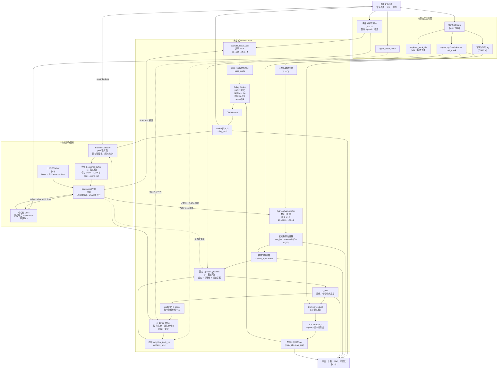

# Opinion Dynamics + MARL 网络结构图

> 代码底座：SigmaRL 1.2.0  
> 理论真源：[`opinion_dynamics_marl_technical_route.md`](opinion_dynamics_marl_technical_route.md)  
> 实施状态：M7 已完成，M8–M10 按图中标记逐步实现  
> 更新日期：2026-08-25

## 1. 整体网络结构



## 2. 每个阶段对应的网络结构

| 阶段 | 对应结构 | 主要工作 | 是否改变动作 |
|---|---|---|---|
| M3，已完成 | EvidenceNet、OpinionDynamics、OpinionResidual | 实现纯数学映射、边界和梯度接口 | 否，尚未接线 |
| M4，已完成 | ConflictGraph、pair features、urgency/confidence、track IDs、reset mask | 从真实车辆状态生成物理交互信息 | 否，Policy 不读取 |
| M5，已完成 | Base Actor 与 residual 的 Policy Bridge | 加载 Base 权重，以 `z_direct=b` 将 residual 加到速度 loc | 是，首次改变动作分布 |
| M6，已完成 | `z_dense`、Stateful Collector | 按车辆身份维护跨时间意见，每步只更新一次；冻结 Evidence | 是，形成真实时间记忆 |
| M7，已完成 | Sequence Buffer | 保存连续 chunk、`z_init/edge_active_init`、ID、mask 和旧 log-prob | 不直接改变动作 |
| M8 | Sequence PPO | 时间维展开意见动力学，使梯度训练 EvidenceNet | 改变训练方式 |
| M9 | Base→Evidence→Joint Trainer | 冻结/解冻参数组，完成三阶段训练和 checkpoint | 改变参数优化范围 |
| M10 | 评估、诊断、PDF、可视化 | 输出 `raw_b/b/z/residual`，评估时不更新参数 | 否 |
| M11 | 正式实验与消融 | 多 seed 比较 Base、TSC、Direct、EMA、GRU 和完整方法 | 实验层 |

R0、R1 和 M2 主要负责环境恢复、Base 产物合同及独立配置入口，不对应新的网络结构，
因此未作为网络节点单独绘制。

## 3. 三个核心变量

```text
b：当前帧产生的瞬时交互证据
z：经过积累、遗忘和自强化后的连续意见
Δμ：意见对车辆速度决策施加的有界修正
```

完整因果链：

```text
当前物理状态
  → pair_features
  → EvidenceNet 得到 b
  → 固定 OpinionDynamics 得到 z
  → OpinionResidual 得到 Δμ
  → 修正 Base Actor 的速度 loc
  → TanhNormal 采样动作
  → 环境 reward
  → PPO 更新 Base Actor 和 EvidenceNet
```

## 4. 邻车 ID 的边界

`neighbor_track_ids` 不属于神经网络特征。它只用于：

```text
当前候选槽位
  → 找到对应的真实邻车轨迹
  → 从 z_dense 取回该车辆的历史意见
```

禁止将 ID 输入 EvidenceNet、Base Actor 或 Critic，也禁止将其解释为 priority、
leader、通行权或学习拓扑。

## 5. 执行期与训练期

执行期只需要：

```text
局部观测 → Base Actor
车辆对物理信息 → EvidenceNet → Dynamics → Residual
两路合并 → TanhNormal → action
```

中心化 Critic、Sequence Buffer 和 PPO 只在训练阶段使用。部署时每辆车根据自身局部
观测、当前可见邻车及本地保存的意见状态分散执行。

M6 当前只训练不读取 `z` 的原 Central Critic，Base Actor 与 EvidenceNet 冻结；图中
PPO 到 Actor/Evidence 的时间梯度是 M8 的目标结构，不代表 M6 已经使用扁平 PPO 更新
循环策略。
